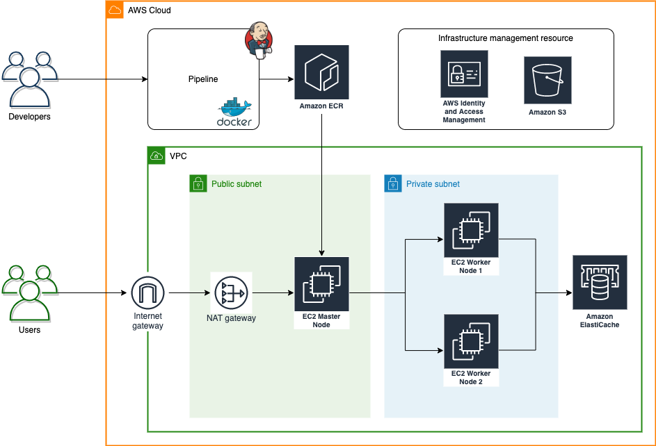

# Technical Test Solution - Arley Coy

This repository provides solutions for the technical test, covering the following aspects:

- [CI/CD Pipeline](#cicd-pipeline)
- [Containerization](#containerization)
- [Infrastructure as Code](#infrastructure-as-code)
- [Provisioning](#provisioning-ansible-playbook)
- [Incident Response](#incident-response-scenario)

Below are detailed explanations, diagrams, code examples, and steps to follow for each section.

---

# CI/CD Pipeline

This repository contains the codebase and Jenkins pipeline configuration to implement a CI/CD flow including the following stages:

### Environment Variables

- `KUBECONFIG_PATH`: The path to the Kubernetes configuration file.

### Parameters

- `AWS_CREDENTIALS_ID`: The AWS Credentials ID for accessing AWS services like ECR.
- `ECR_REGISTRY`: The URL for the AWS ECR registry.
- `AWS_REGION_CHOICE`: A dropdown list for selecting the AWS region.
- `AWS_REGION_CUSTOM`: A field for entering a custom AWS region if "Other (please specify)" is selected in the dropdown list.

### Stages

#### 1. Determine AWS Region

This stage sets the AWS region based on the choice or custom input from the user.

#### 2. Compilation & Tests

This stage performs compilation and testing of the Frontend and Backend in parallel.

##### Frontend Compilation & Tests

- Installs the Frontend dependencies and runs tests.

##### Backend Compilation & Tests

- Installs the Backend dependencies and runs tests.

#### 3. Docker Build & Push

This stage builds and pushes Docker images for the Frontend and Backend to the AWS ECR registry.

- Logs into the AWS ECR registry.
- Builds and pushes the Frontend and Backend Docker images based on their respective `VERSION` files.

#### 4. Deploy on Kubernetes

This stage deploys the Frontend and Backend on a Kubernetes cluster.

- Deploys a Redis container if not already deployed.
- Deploys Frontend and Backend containers.

#### 5. Rollback Option

This stage provides an option to rollback Frontend and/or Backend deployments to a previous version.

### How to Use

1. Ensure that the necessary credentials for AWS and Kubernetes are configured in Jenkins.
2. Set up your AWS ECR registry and add the URL to the `ECR_REGISTRY` parameter.
3. Add the path to your Kubernetes config file in the `KUBECONFIG_PATH` environment variable.
4. Execute the Jenkins pipeline and provide the necessary parameters.

### Additional Notes

- Make sure the `VERSION` file exists in both the Frontend and Backend directories.
- Ensure that the Kubernetes deployment files (`kubernetes-deployment.yaml`) are in the correct directories for Frontend and Backend.
- For rollbacks, the pipeline is configured to roll back to version `v1` of the Frontend and Backend. Update this as needed.

**Disclaimer**: This Jenkinsfile is intended as a sample and may require adjustments to fit your specific needs. Always thoroughly review and test pipeline code before running it in a production environment.

---

# Containerization

Deploy a multi-container application comprising the `Ariane` frontend, `Falcon` backend, and `Redis` using Docker and Kubernetes.

## Prerequisites

- **Docker**: Ensure [Docker](https://docs.docker.com/get-docker/) is installed.
- **Kubernetes Cluster**: Have a cluster up and `kubectl` set up.
- **Git**: For repository cloning.

## Dockerization

1. Clone the the repositories

git clone https://github.com/slgevens/example-ariane.git
git clone https://github.com/slgevens/example-falcon.git

> [!IMPORTANT]
> To deploy functionally the frontend app integrated with backend app there were some changes regarding to the backend integration onto Frontend code. This can be demonstrated on the [app.js](./frontend-ariane/app.js) file

2. Develop the Dockerfile Script for all apps as is shown:
   **Frontend Ariane**

```Dockerfile
FROM --platform=linux/amd64 node:14

WORKDIR /usr/src/app
COPY package*.json ./
RUN npm install
# RUN npm ci --only=production
COPY . .

EXPOSE 3000

CMD [ "node", "app.js" ]
```

**Backend Falcon**

```Dockerfile
FROM --platform=linux/amd64 golang:1.19

WORKDIR /app
COPY go.mod go.sum ./
RUN go mod download
COPY *.go ./

RUN CGO_ENABLED=0 GOOS=linux go build -o /backend
EXPOSE 4000

CMD ["/backend"]
```

**Redis Dockefile**

```Dockerfile
FROM --platform=linux/amd64 ubuntu:14.04
RUN apt-get update && apt-get install -y redis-server
EXPOSE 6379
ENTRYPOINT ["/usr/bin/redis-server"]
```

To accomplish properly the Dockerization there are some considerations to have:

- The platform definition is required
- The port must be taken into account for the Kubernetes part

## Kubernetes Deployment

The configuration to proceed to the deployment is shown in the next architecture where the cluster is going to be configured in **2 ec2 servers** as was required in the [Infrastructure as Code](#infrastructure-as-code) part and a **Master Node** which will manage the Kubernetes deployment.


1. **Set up an S3 bucket** to store the cluster state.
2. Configure `kops` to use the S3 bucket.
3. Create the cluster using `kops create cluster`.
4. **Edit the cluster** configuration if needed, using `kops edit cluster`.
5. Deploy the cluster using `kops update cluster --yes`.

#### Redis Deployment

Set up configurations for:

- PersistentVolume (PV), PersistentVolumeClaim (PVC), Deployment and Service
- The Service for Redis to expose it within the cluster on port 6379.

#### Falcon Backend Deployment

For the backend:

- Create a ConfigMap for varying configurations. This will contain the Redis URL for communication.

```yaml
apiVersion: v1
kind: ConfigMap
metadata:
  name: falcon-config
data:
  REDIS_URL: "redis:6379"
```

#### Ariane Frontend Deployment

For the frontend:

- Set up Deployment and Service configurations.
- Ensure it communicates with Falcon Backend through Kubernetes Service.

### Networking

- Frontend ('Ariane') communicates with Backend ('Falcon') through a Service.
- Backend ('Falcon') communicates with 'Redis' through a Service.

### Post-deployment

1. Verify that all pods and services are running as expected using `kubectl get pods,services`.
2. Test communication between the frontend and backend to ensure that the data flow is seamless and that the backend can communicate with **Redis**.

In the kubernetes configuration there must be a `KUBECONFIG` file as is shown bellow:

```yaml
apiVersion: v1
clusters:
  - cluster:
      certificate-authority-data: BASE64_ENCODED_CA_CERT
      server: https://YOUR_ELASTIC_IP:6443
    name: my-k8s-cluster
contexts:
  - context:
      cluster: my-k8s-cluster
      user: admin
    name: admin@my-k8s-cluster
current-context: admin@my-k8s-cluster
kind: Config
preferences: {}
users:
  - name: admin
    user:
      client-certificate-data: BASE64_ENCODED_CLIENT_CERT
      client-key-data: BASE64_ENCODED_CLIENT_KEY
```

- `certificate-authority-data`: This is your **CA certificate** used to validate the server's certificate. It needs to be base64 encoded.
- `server`: The server URL is where your Kubernetes API server is running. If you're running the API server on an **EC2 instance with an Elastic IP**, replace **YOUR_ELASTIC_IP** with the actual IP.
- `client-certificate-data` & `client-key-data`: These are used for client authentication against the server. They also need to be **base64** encoded.

---

# Infrastructure as Code

This Terraform setup provisions infrastructure on AWS with a specific focus on VPC, EC2, Elasticache, and S3 configurations.

### Infrastructure Components

- **VPC**:

  - **Internet Gateway** for public web access.
  - **NAT Gateway** located within the public subnet to grant private subnet instances internet access.
  - A public and a private subnet.
  - An associated Elastic IP for the NAT Gateway.
  - Proper routing configurations for both subnets.
  - Security groups to regulate inbound and outbound traffic.

- **EC2**:

  - Two instances residing within the private subnet.
  - IAM role to facilitate communication between instances.

- **Elasticache**:

  - Redis instance residing in the private subnet.
  - Associated security group to permit traffic on port `6379`.

- **S3 Bucket**:
  - Named `prrtprrt-arley` (replace `arley` with your actual name).
  - Versioning enabled.
  - Server-side encryption activated with a custom key aliased as `prrtprrt-arley`.

To accomplish the deployment process there is necessary to provision two other resources which are **Application Locad Balancer** and **Elastic Container Registry** to configure the access to the app and manage the image storing. These resources can be provided manually

- **Application Load Balancer (ALB)**:

  - Configured to route external traffic to the Kubernetes applications running on the worker nodes.

- **Elastic Container Registry (ECR)**:
  - A Docker image registry for storing and managing application container images.
  - Images from ECR can be deployed to the Kubernetes worker nodes.

> [!IMPORTANT]
> Also there is a necessary to provide a master node for managing the Kubernetes cluster with `kops` tool.

### Prerequisites

- [Terraform](https://www.terraform.io/downloads.html) installed.
- AWS credentials set up either via the AWS CLI or environment variables.

### File Structure

.
├── vpc.tf
├── ec2.tf
├── elasticache.tf
├── s3.tf
└── provider.tf

### Cautionary Notes

- Always verify AWS resource limits to ensure you can provision the desired resources.
- Familiarize yourself with AWS's pricing model to avoid unexpected costs.
- Remember to destroy resources post-testing to avoid unnecessary AWS charges.

---

# Provisioning (Ansible Playbook)

To accomplish the requirement the tool to be used will be **Ansible playbook** automates several system configurations and tasks including:

- Setting system open file limits.
- User account creation with associated SSH keys.
- Docker package installation and container execution.
- Nginx installation and configuration to forward requests.

### Structure

- **`site.yml`**: This is the main playbook that orchestrates the execution of different roles.
- **`roles/`**: Contains specific roles and tasks:
  - **`system_config`**: Sets system-wide configurations.
  - **`user_setup`**: Manages user accounts, SSH keys, and user info files.
  - **`docker`**: Handles Docker installation and container execution.
  - **`nginx`**: Installs and configures Nginx.

### Prerequisites

1. Ansible installed on your machine or Ansible control node.
2. Properly configured Ansible hosts file (`/etc/ansible/hosts`).
3. `ansible-vault` for encrypting sensitive data.

### Getting Started

1. Access to the Ansible folder:

   ```bash
   cd Ansible
   ```

2. Encrypt user passwords using `ansible-vault`:

   ```bash
   ansible-vault encrypt_string 'USER_PASSWORD' --name 'passwd'
   ```

   Replace `USER_PASSWORD` with the actual password. Copy the output to the `roles/user_setup/vars/main.yml` file.

3. Run the playbook:
   ```bash
   ansible-playbook site.yml --ask-vault-pass
   ```

### Notes

- Ensure your target hosts are correctly specified in the Ansible hosts file.
- Always review and adjust the playbook and roles to better fit your specific environment and requirements.
- It's recommended to test the playbook in a staging environment before deploying in production.

# Incident Response Scenario

For this requirement there is a drafted document in the solution folder addressed as README.md [incident-response-scenario](steps-to-solve-incident/README.md)

## Troubleshooting

If you encounter any issues, please refer to the interviewer to clarifications.
